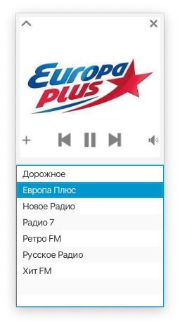
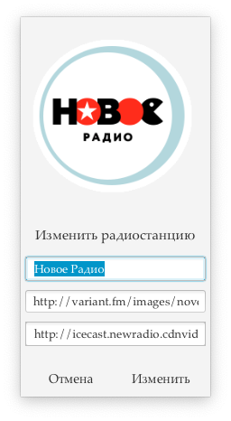
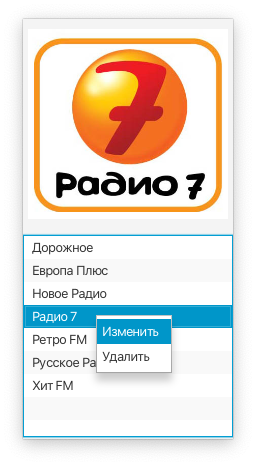
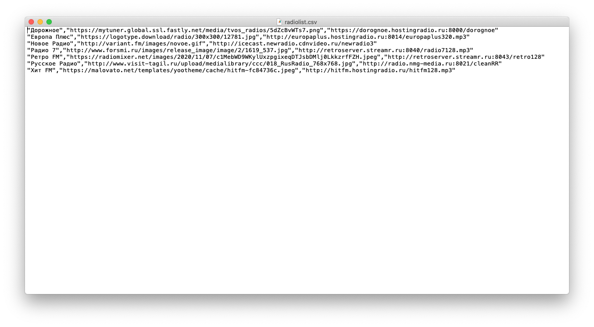

#Radio Online
Приложение для воспроизведения интернет-радио.
Разработано с использованием библиотек Java 11, JavaFX 18, OpenCSV 5.6.

###Особенности:
+ Добавление, изменение, удаление радиостанций
+ Всплывающая панель управления
+ Компактный вид
+ Логотип радиостанций
+ Список радиостанций сохраняется в файле формате CSV

Все необходимые для работы библиотеки в каталоге 'lib'.
